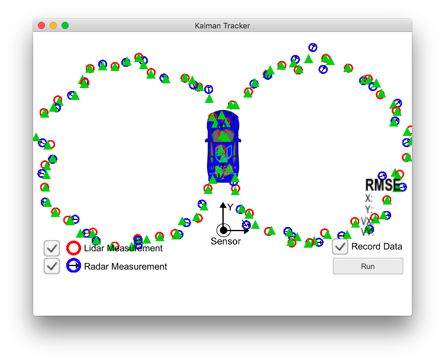

# Extended Kalman Filter
Self-Driving Car Engineer Nanodegree Program

---
This project fuses lidar (laser) and radar measurements to locate and track an object. Lidar measurements provide high resolution estimates of position but say nothing of velocity. Radar on the other hand provides a noisier estimate of position, and via the doplar effect also provides an estimate of velocity. 

The Kalman filter follows a simple loop:

1. observe the world
2. predict the objects new state based on the last values and the state transition function F.
3. update the prediction with values measured. 

We assume here that the measurement noise can be modeled by a gaussian. The radar's measurements are given in polar and after mapping to rectangular the noise term will no longer be normal. To account for this we linearize the transformation to rectangular via a first order taylor expansion.

figure 8 tracking test:

## Dependencies

* cmake >= 3.5
 * All OSes: [click here for installation instructions](https://cmake.org/install/)
* make >= 4.1
  * Linux: make is installed by default on most Linux distros
  * Mac: [install Xcode command line tools to get make](https://developer.apple.com/xcode/features/)
  * Windows: [Click here for installation instructions](http://gnuwin32.sourceforge.net/packages/make.htm)
* gcc/g++ >= 5.4
  * Linux: gcc / g++ is installed by default on most Linux distros
  * Mac: same deal as make - [install Xcode command line tools]((https://developer.apple.com/xcode/features/)
  * Windows: recommend using [MinGW](http://www.mingw.org/)

## Basic Build Instructions

1. Clone this repo.
2. Make a build directory: `mkdir build && cd build`
3. Compile: `cmake .. && make` 
   * On windows, you may need to run: `cmake .. -G "Unix Makefiles" && make`
4. Run it: `./ExtendedKF path/to/input.txt path/to/output.txt`. You can find
   some sample inputs in 'data/'.
    - eg. `./ExtendedKF ../data/sample-laser-radar-measurement-data-1.txt output.txt`

## Code Style

Please (do your best to) stick to [Google's C++ style guide](https://google.github.io/styleguide/cppguide.html).

## Generating Additional Data

This is optional!

If you'd like to generate your own radar and lidar data, see the
[utilities repo](https://github.com/udacity/CarND-Mercedes-SF-Utilities) for
Matlab scripts that can generate additional data.